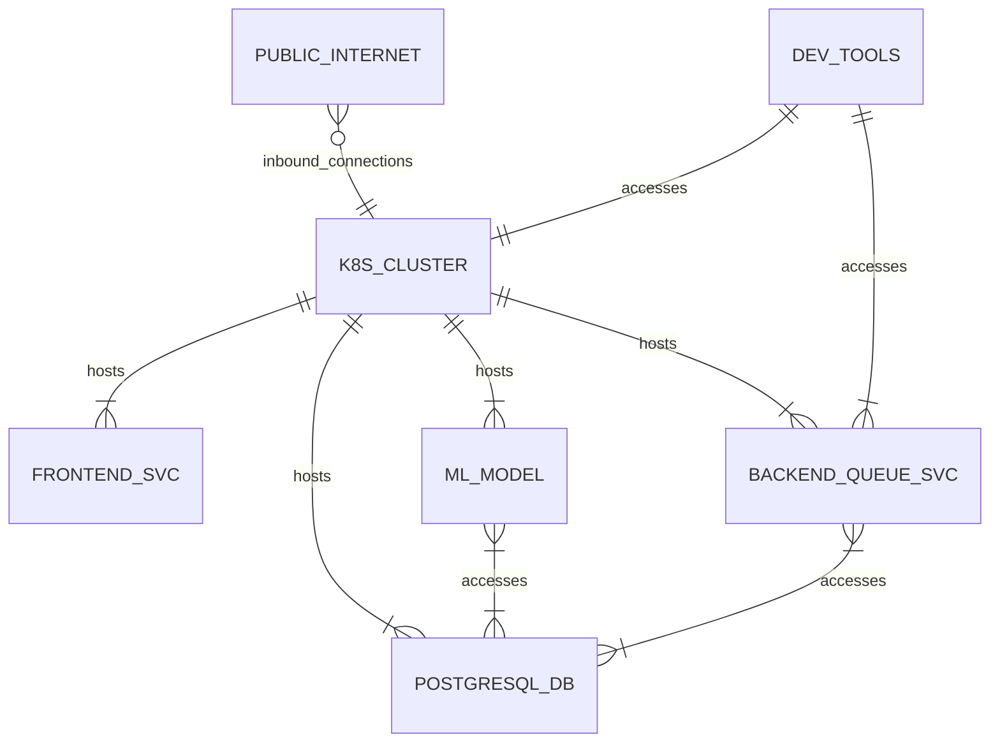
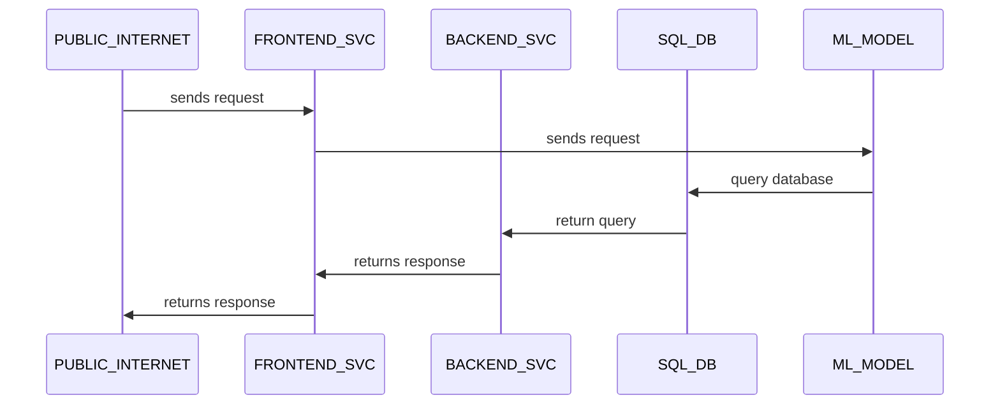
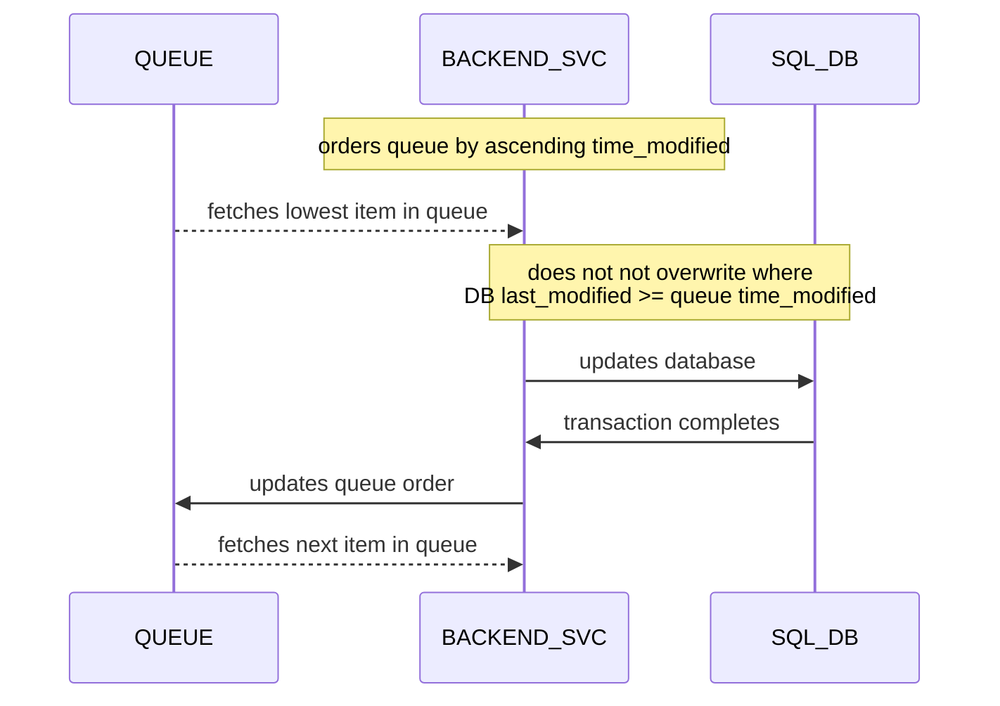

# Architecture
Everything you need to know about the architecture.
Latest version can be viewed [here](https://github.com/mxava/mcbroken-ml/blob/main/README.md)

## SVC Relationship Diagram

## SVC Sequence Diagram - Frontend

## SVC Sequence Diagram - Backend
### Queue Handling

