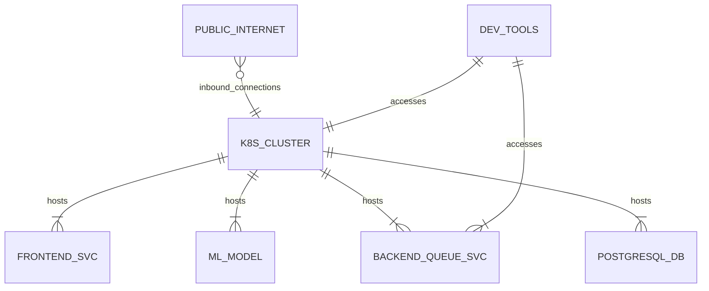

# Svc Relationship Diagram
Latest version can be viewed [here](https://github.com/mxava/mcbroken-ml/architecture.md)

```mermaid
erDiagram
    PUBLIC_INTERNET }o--|| K8S_CLUSTER : inbound_connections
    K8S_CLUSTER ||--|{ FRONTEND_SVC : hosts
    K8S_CLUSTER ||--|{ ML_MODEL : hosts
    K8S_CLUSTER ||--|{ BACKEND_QUEUE_SVC : hosts
    K8S_CLUSTER ||--|{ POSTGRESQL_DB : hosts
    DEV_TOOLS ||--|{ BACKEND_QUEUE_SVC : accesses
    DEV_TOOLS ||--|| K8S_CLUSTER : accesses
```
